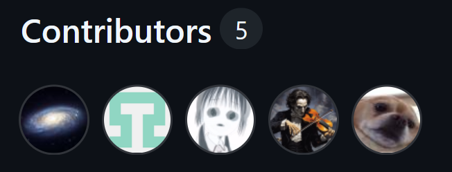

<a id="readme-top"></a>

<!-- PROJECT SHIELDS -->
[![Contributors][contributors-shield]][contributors-url]


<!-- PROJECT LOGO -->
<br />
<div align="center">
  <a href="https://github.com/naumiaparanji/themeparkmanagement">
    
  </a>

<h3 align="center">Seven Flags Theme Park Management System</h3>

  <p align="center">
    COSC3380 Database Project
    <br />
    <a href="https://github.com/naumiaparanji/themeparkmanagement"><strong>Explore the docs »</strong></a>
    <br />
    <br />
    <a href="https://notflag6.com/">View Project</a>
  </p>
</div>

<!-- TABLE OF CONTENTS -->
<details>
  <summary>Table of Contents</summary>
  <ol>
    <li>
      <a href="#about-the-project">About The Project</a>
      <ul>
        <li><a href="#built-with">Built With</a></li>
      </ul>
    </li>
    <li>
      <a href="#getting-started">Getting Started</a>
      <ul>
        <li><a href="#prerequisites">Prerequisites</a></li>
        <li><a href="#installation">Installation</a></li>
      </ul>
    </li>
    <li><a href="#usage">Usage</a></li>
    <li><a href="#contributors">Contributors</a></li>
    <li><a href="#contact">Contact</a></li>
    <li><a href="#acknowledgments">Acknowledgments</a></li>
  </ol>
</details>


<!-- ABOUT THE PROJECT -->
## About The Project

[![Seven Flags][product-screenshot]](https://notflag6.com/)

A full-stack project for Database Systems (COSC3380) course at the University of Houston. This project highlights data collection to provide reports on rides and events of a theme park, as well as providing tools for managing them.

<p align="right">(<a href="#readme-top">back to top</a>)</p>


### Built With

* [![React][React.js]][React-url]
* [![Express][Express.js]][Express-url]
* [![MySQL][MySQL]][MySQL-url]
* [![Bootstrap][Bootstrap.com]][Bootstrap-url]

<p align="right">(<a href="#readme-top">back to top</a>)</p>


<!-- GETTING STARTED -->
## Getting Started

To get a local copy up and running follow these simple example steps.

### Prerequisites

<!-- TODO IAN start -->
* npm
  ```sh
  npm install npm@latest -g
  ```

### Installation

1. Get a free API Key at [https://example.com](https://example.com)
2. Clone the repo
   ```sh
   git clone https://github.com/naumiaparanji/themeparkmanagement.git
   ```
3. Install NPM packages
   ```sh
   npm install
   ```
4. Enter your API in `config.js`
   ```js
   const API_KEY = 'ENTER YOUR API';
   ```
5. Change git remote url to avoid accidental pushes to base project
   ```sh
   git remote set-url origin github_username/repo_name
   git remote -v # confirm the changes
   ```

<p align="right">(<a href="#readme-top">back to top</a>)</p>

<!-- TODO IAN end -->


<!-- USAGE -->
## Usage

The Theme Park Management System is our solution to manage data related to Seven Flags' operations. This all-in-one website offers the ability for customers to purchase tickets and sign up for our exclusive events, as well as allowing our wonderful employees to work with data pertaining to rides, ride maintenance, and events while providing detailed reports on them.

#### User Roles and Data Management
* Customer: Can sign up for an account, purchase tickets, and sign up for events as well as view all the amentities Seven Flags has to offer. 
* Employee:  Can submit, modify, or delete maintenance requests and submit ride runs.
* Manager: Have the same priviledges as employees on top of the ability to view reports.
* Admin: Have the same priviledges as managers as well as the following capabilities:
    * Add, modify, and delete Customers and Employees information
    * Add, modify, and delete Rides
    * Add, modify, and delete Attractions
    * Add, modify, and delete Events

#### Queries/Reports
* Maintenance Status: A report of all maintenance requests that allows for filtering by ride name, ride category, maintenance ticket status, and the dates between which the ticket was submitted. 
* Event Sales:
    * Summary: Report of the total sales from each Event.
    * Individual Sales: Report of each single sale that includes information on who purchased the pass and whether they have checked in for the event; allows for filtering by event name, and the dates between which the event pass was purchased.
* Ride Popularity:
    * Category Popularity Summary and Ride Popularity Summary: Reports that indicate how popular a ride is based on the occupancy versus capacity of the ride.
    * Individual Runs: Detailed log of each time a ride is operated on; allows for filtering by dates between which the rides were run.

<p align="right">(<a href="#readme-top">back to top</a>)</p>


<!-- TODO NAUMI start -->
## Semantic Constraints and Triggers

- [ ] Feature 1
- [ ] Feature 2
- [ ] Feature 3
    - [ ] Nested Feature

<!-- TODO NAUMI end -->

<p align="right">(<a href="#readme-top">back to top</a>)</p>

## Contributors:

<a href="https://github.com/naumiaparanji/themeparkmanagement/graphs/contributors">
  
</a>

<!-- CONTACT -->
### Contact

Project GitHub: [Link](https://github.com/naumiaparanji/themeparkmanagement)
Live Website: [Link](https://notflag6.com/)

<p align="right">(<a href="#readme-top">back to top</a>)</p>

<!-- ACKNOWLEDGMENTS -->
## Acknowledgments

Our amazing TAs

README Template: [https://github.com/othneildrew/Best-README-Template](https://github.com/othneildrew/Best-README-Template)

<p align="right">(<a href="#readme-top">back to top</a>)</p>


<!-- MARKDOWN LINKS & IMAGES -->
<!-- https://www.markdownguide.org/basic-syntax/#reference-style-links -->
[contributors-shield]: https://img.shields.io/github/contributors/github_username/repo_name.svg?style=for-the-badge
[contributors-url]: https://github.com/naumiaparanji/themeparkmanagement/graphs/contributors
[product-screenshot]: ./themepark_website/src/images/LiveWebsiteScreenShot.png
[React.js]: https://img.shields.io/badge/React-20232A?style=for-the-badge&logo=react&logoColor=61DAFB
[React-url]: https://reactjs.org/
[Express.js]:https://img.shields.io/badge/Express%20js-000000?style=for-the-badge&logo=express&logoColor=white
[Express-url]:https://expressjs.com/
[MySQL]:https://img.shields.io/badge/MySQL-4479A1?style=for-the-badge&logo=mysql&logoColor=white
[MySQL-url]:https://www.mysql.com/
[Bootstrap.com]: https://img.shields.io/badge/Bootstrap-563D7C?style=for-the-badge&logo=bootstrap&logoColor=white
[Bootstrap-url]: https://getbootstrap.com